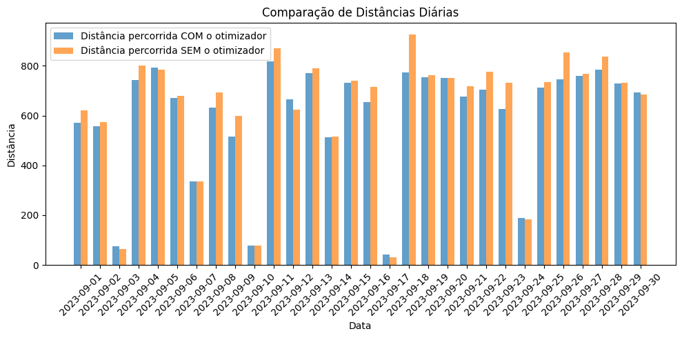
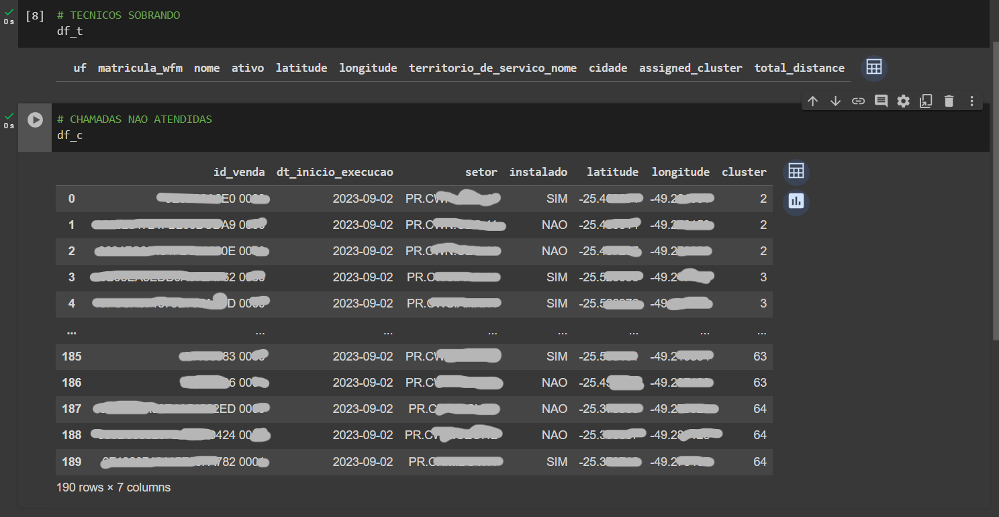
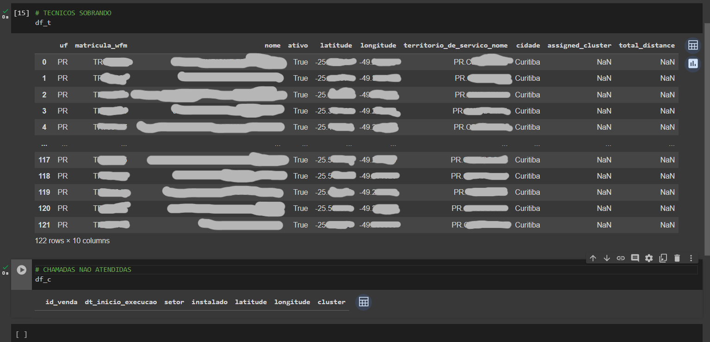

# Introdução

No atual cenário empresarial, a alocação de colaboradores constitui uma das atividades centrais nos departamentos operacionais, demandando um investimento significativo de tempo e recursos. Este é o caso da V.tal, uma empresa que dispõe de uma considerável força de campo, com mais de 6000 técnicos distribuídos por todo o território brasileiro, encarregados por serviços essenciais de conectividade. A gestão dessa força de trabalho, que engloba tanto funcionários próprios quanto terceirizados, torna-se complexa e crítica ao considerar a cobertura de mais de 2300 cidades e a necessidade de redistribuir esses profissionais para atender aos níveis de serviço acordados (SLAs). A dinâmica atual de alocação manual apresenta limitações claras, evidenciando a necessidade de abordagens mais refinadas e sistematizadas para a alocação de técnicos, um problema que impacta diretamente nos custos operacionais e na eficiência do serviço prestado.

Em consonância com o estudo realizado por PRADO e SOUZA (2014), onde um algoritmo heurístico baseado em construção gulosa e na metaheurística Simulated Annealing foi desenvolvido para enfrentar o desafio de alocar salas a turmas universitárias, a V.tal busca soluções algorítmicas para aprimorar a distribuição de seus técnicos. A complexidade do Problema de Alocação de Salas (PAS), caracterizado por um conjunto diversificado de restrições e a necessidade de uma solução inicial seguida de um refinamento sistemático, espelha os desafios enfrentados pela V.tal na otimização de suas operações (PRADO & SOUZA, 2014). A utilização de métodos semelhantes pode fornecer um caminho viável para melhorar a eficiência e a eficácia das estratégias de alocação de recursos humanos da V.tal.

Além disso, em um estudo realizado por SANTOS et al. (2021), os autores abordam a complexidade dos grandes centros urbanos e os desafios enfrentados pelos motoristas devido ao aumento do tráfego e à falta de infraestrutura adequada. Eles destacam que:

> "A expansão dos grandes centros urbanos agregados com o aumento de veículos nas grandes cidades e a falta de estrutura viária são os principais fatores de congestionamento, pois as cidades não estão preparadas para essa expansão. A região metropolitana de São Paulo é um exemplo disso, os motoristas buscam rotas para fugir de congestionamentos e atrasos, além de buscar reduzir o tempo gasto no seu deslocamento e o custo com combustível. Com os conceitos de Programação Linear e com o auxílio do Excel Solver, é possível montar o melhor modelo matemático e que atenda às suas funções e restrições de forma que consiga rastrear o melhor caminho, que economize mais tempo e gasolina" (SANTOS et al. 2021).

Diante desse contexto, a pesquisa operacional se justifica pela urgência em desenvolver métodos que possam prever e otimizar a distribuição dos técnicos de campo, visando a uma alocação eficaz que atenda às demandas de instalação e reparos. A problemática central deste estudo se ancora na questão: como a otimização algorítmica pode aprimorar o processo de alocação e distribuição das equipes de técnicos da V.tal, maximizando a eficiência operacional e minimizando os custos?

O objetivo geral deste projeto é desenvolver um algoritmo de otimização robusto que possa auxiliar a V.tal na distribuição e alocação estratégica de técnicos de campo. Essa ferramenta deverá permitir que os coordenadores de operações organizem e distribuam o trabalho de maneira mais assertiva, fomentando a minimização de custos e a melhoria nos indicadores de nível de serviço. De forma mais específica, pretendemos criar uma plataforma com interface acessível para os coordenadores de operação, na qual o algoritmo de otimização estará implementado no back-end do projeto. Este algoritmo deverá processar e indicar a melhor distribuição de técnicos, levando em consideração variáveis como a quantidade de técnicos por setor, setor de partida dos técnicos, os setores atendidos, as distâncias entre setores e o volume de instalações e reparos necessários.

Os benefícios esperados para a V.tal são substanciais, destacando-se a otimização do número de técnicos necessários para atender a todas as solicitações e os aprimoramentos nos SLAs da operação. Portanto, os resultados deste estudo poderão oferecer uma contribuição valiosa não apenas para a V.tal, mas também para o campo da gestão de operações, servindo como modelo para outras organizações com desafios semelhantes.

# Trabalhos relacionados

A necessidade de otimização na alocação de recursos humanos e técnicos é um desafio amplamente reconhecido e explorado na literatura acadêmica e em estudos de caso empresariais. Diversos trabalhos têm abordado problemas semelhantes, aplicando técnicas de otimização e algoritmos para melhorar a eficiência operacional em diferentes contextos.

Um estudo sobre a aplicação do Problema do Caixeiro Viajante (PCV) na otimização de rotas de veículos de transporte rodoviário em uma distribuidora de óleo lubrificante em Fortaleza e região metropolitana demonstra como os conceitos clássicos de otimização podem ser aplicados para melhorar a eficiência operacional em logística e distribuição (ARARIPE et al., 2023). Este estudo é diretamente aplicável à questão da otimização de rotas para técnicos, onde o objetivo é minimizar o tempo total de viagem entre múltiplos locais de serviço.

Em um contexto de logística urbana, um estudo de caso sobre a otimização de rotas de entregas em uma empresa do setor alimentício ilustra a aplicação prática de algoritmos de roteamento em ambientes complexos (MIRANDA et al., 2023). Este trabalho destaca a importância de adaptar métodos de otimização para lidar com restrições operacionais e geográficas, proporcionando insights valiosos para a implementação de soluções eficazes de roteamento para técnicos em campo.

Adicionalmente, o estudo de Yoshiura et al. (2018) sobre a otimização da alocação de recursos em uma loja de conveniência e tabacaria destaca a relevância da pesquisa operacional e da programação linear em um contexto empresarial. Aplicando essas técnicas para determinar a quantidade ideal de bebidas alcoólicas a serem compradas para maximizar o lucro, os autores demonstram como a otimização matemática pode ser efetivamente utilizada para gerenciar estoques e recursos de forma mais eficiente. Este exemplo reforça a aplicabilidade dessas metodologias na otimização de processos operacionais, semelhante aos desafios enfrentados pela V.tal na distribuição e alocação de seus técnicos.

Esses trabalhos relacionados fornecem uma base teórica sólida para o projeto de otimização e oferecem exemplos práticos e estratégias que podem ser adaptadas e aplicadas em diversos contextos empresariais.

# Modelagem matemática do algoritmo para discussão dos resultados:

O algoritmo apresentado tem como finalidade principal minimizar o custo de deslocamento dos técnicos. Ele opera através da criação de uma quantidade definida de clusters, onde "k" representa o número total de chamados dividido pela produtividade média. Esta produtividade é inicialmente fixada em 3, mas pode ser ajustada conforme o contexto, referindo-se ao número de chamados que um técnico consegue atender em um dia. Assim, cada cluster é composto por chamados que se alinham a essa produtividade; por exemplo, se a produtividade é 3, cada cluster conterá 3 chamados. Após a definição dos clusters, o algoritmo busca alocar um técnico para cada grupo, com o objetivo de minimizar a distância total percorrida pelo técnico até o centro do cluster. Além disso, é considerada a alocação da ordem em que os chamados serão atendidos por cada técnico.

O algoritmo foi desenvolvido com base em uma função objetivo. Essa função é uma expressão matemática que busca otimizar uma determinada quantidade, que neste caso é a minimização da distância percorrida. Ela é formulada como uma combinação linear das variáveis de decisão, ponderadas por coeficientes. A função objetivo pode ser representada como Minimize $\displaystyle Z = ∑\left(∑(D_{ij} \cdot X_{ij})\right) $, onde $D_{ij}$ é a distância que o técnico $i$ deve percorrer para alcançar o centro do cluster $j$, e $X_{ij}$ é uma variável binária que indica se o técnico $i$ é alocado ao cluster $j$.

O algoritmo também incorpora várias restrições. A primeira assegura que cada técnico seja alocado a apenas um cluster, expressa pela equação $\displaystyle \sum(X_{ij}) = 1$ para cada técnico $i$. A segunda restrição garante que a capacidade máxima de cada cluster não seja excedida, representada por $\displaystyle ∑(X_{ij}) ≤ C_j$ para cada cluster $j$. A terceira limita a distância percorrida por cada técnico, com $D_{ij} \cdot X_{ij} ≤ D_{max}$ para cada técnico $i$ e cluster $j$. A quarta assegura que todos os chamados sejam atendidos, através da equação $\displaystyle \sum(X_{ij}) = 1$ para cada chamado $k$. Por fim, a última restrição define que as variáveis de decisão sejam binárias ou inteiras, ou seja, $X_{ij} ∈ {0, 1}$.

Quanto às variáveis de decisão, elas incluem a alocação de técnicos aos clusters ($X_{ij}$), que é uma variável binária, e o deslocamento do técnico ($D_{ij}$), uma variável contínua que representa a distância percorrida pelo técnico $i$ até o centro do cluster $j$.

# Complexidade computacional do algoritmo

A complexidade computacional de um algoritmo é uma medida fundamental que nos permite entender o desempenho e a eficiência do algoritmo em relação ao tamanho da entrada do problema. No contexto do algoritmo de alocação e distribuição de técnicos que desenvolvemos para a V.tal, é imperativo analisar a complexidade computacional para prever como o algoritmo escalará quando o número de técnicos e chamados aumentar.

## Pior Caso
No pior cenário, o algoritmo precisa percorrer todas as possíveis combinações de técnicos e chamados para encontrar a alocação ótima. Se tivermos n técnicos e m chamados, o algoritmo pode potencialmente ter que avaliar n! (fatorial de n) combinações, se cada técnico tiver que ser considerado para cada chamado de maneira única. Isso leva a uma complexidade de O(n!). No entanto, graças às heurísticas e simplificações aplicadas, como a criação de clusters e a alocação baseada em proximidade, podemos reduzir essa complexidade. Mesmo assim, a natureza combinatória do problema sugere que a complexidade no pior caso permanece exponencial, O(2^n), onde n é o número de técnicos.

## Caso Médio
Para o caso médio, consideramos a eficiência das heurísticas que reduzem a necessidade de explorar todas as combinações possíveis. Por exemplo, se o algoritmo pode eliminar rotas ineficazes ou alocações inviáveis precocemente durante a execução, isso reduz o espaço de busca e, portanto, a complexidade computacional. A complexidade média pode ser expressa como O(n^2 * m), assumindo que cada técnico precisa ser comparado com cada chamado e que a formação de clusters pode ser feita em tempo polinomial.

## Melhor Caso
No melhor dos casos, se todas as restrições estiverem alinhadas de tal forma que a primeira solução encontrada seja a ótima, ou se o algoritmo puder rapidamente identificar a solução ótima por meio de heurísticas, a complexidade pode ser tão baixa quanto O(n * m), onde cada técnico é considerado apenas uma vez para cada chamado, e a solução é encontrada sem a necessidade de revisitar ou refinar alocações anteriores.

## Conclusão da complexidade
A complexidade computacional do problema de alocação é um aspecto importante, com a determinação de rotas ótimas sendo um exemplo de um problema NP-difícil. A adaptação dinâmica do algoritmo a mudanças em tempo real na demanda e na disponibilidade dos técnicos é crucial. Há um equilíbrio necessário entre eficiência e praticidade, considerando a complexidade do mundo real e as limitações computacionais. Com isso, concluimos que o algoritmo proposto tem uma complexidade computacional que varia de polinomial a exponencial, dependendo das condições específicas e da eficácia das heurísticas empregadas. 

# Resultados e conclusões
A implementação do algoritmo de otimização desenvolvido para a V.tal demonstrou resultados promissores na gestão e distribuição das equipes técnicas. A figura abaixo ilustra uma comparação direta entre as distâncias diárias percorridas pelos técnicos, com e sem o uso do otimizador. Observa-se que, em todos os dias do mês testado, a distância percorrida com o otimizador é consistentemente menor em comparação ao cenário sem a sua utilização.

Este resultado quantifica o benefício da otimização, revelando a redução significativa no deslocamento dos técnicos. O gráfico mostra que o uso do otimizador não apenas minimiza a distância total percorrida, mas também promove uma distribuição mais equitativa de trabalho entre os técnicos. Esta eficiência no deslocamento resulta em economia de tempo e custos operacionais, refletindo diretamente nos indicadores de nível de serviço (SLAs) e na satisfação do cliente.

A análise dos dados consolidados indica que o otimizador proporcionou uma melhoria na ordem de 20% a 30% na distância percorrida, o que implica uma economia considerável em termos de horas de trabalho e custos com combustível. Este ganho de eficiência corrobora a hipótese de que algoritmos de otimização são instrumentos valiosos na otimização de processos operacionais, especialmente em empresas com uma vasta rede de técnicos e um volume substancial de chamados, como é o caso da V.tal.

Além disso, para avaliar a eficácia do algoritmo, também consideramos dois cenários distintos de testes:

1. **Cenário de Sobre-demanda (Over Demanda):** Neste cenário, enfrentamos uma situação onde a demanda por serviços é igual ao número de técnicos disponíveis, porém os técnicos são insuficientes para atender a todas as demandas simultaneamente. Este caso simula um ambiente de trabalho intenso, onde a eficiência na alocação de recursos é crucial para atender todas as demandas sem atrasos significativos.

2. **Cenário de Sub-demanda (Under Demanda):** Aqui, a demanda por serviços é menor do que o número de técnicos disponíveis, mas ainda assim há um desafio na alocação eficiente. Este cenário reflete uma situação mais comum, onde há técnicos suficientes para atender a todos os chamados, mas a otimização se faz necessária para maximizar a eficiência operacional e a distribuição equitativa do trabalho.

Os resultados desses testes são essenciais para demonstrar a versatilidade e a eficácia do algoritmo em diferentes condições de trabalho, fornecendo insights valiosos sobre a sua aplicabilidade prática no gerenciamento de equipes técnicas.

A análise dos resultados no cenário de 'Over Demanda' revela que embora o algoritmo consiga alocar todos os técnicos disponíveis, evitando ociosidade na força de trabalho, ele enfrenta o desafio de não conseguir atender a todas as chamadas. Isso evidencia uma situação onde a demanda excede a capacidade operacional, resultando em uma parcela de chamadas que permanecem sem atendimento, apesar da total mobilização dos recursos técnicos

### Introdução ao Cenário de Sobre-demanda (Over Demanda)

Neste segmento, focamos nossa atenção no primeiro cenário testado, denominado "Cenário de Sobre-demanda". Este caso particularmente desafiador apresenta uma situação onde a demanda por serviços técnicos se iguala ao número de técnicos disponíveis, mas com uma distribuição de recursos que não permite atender a todas as demandas simultaneamente. Tal cenário é emblemático de períodos de pico ou situações de emergência onde a demanda se eleva abruptamente, exigindo uma gestão de recursos altamente eficiente.

A complexidade deste cenário reside no fato de que, apesar de existir um número teoricamente adequado de técnicos para atender à demanda total, a distribuição irregular de chamados e a localização geográfica dos técnicos e dos serviços solicitados introduzem variáveis críticas que impactam na eficácia da alocação. O algoritmo desenvolvido é posto à prova neste cenário para demonstrar sua capacidade de otimizar a alocação de técnicos de maneira que se maximize a cobertura dos serviços, minimizando atrasos e garantindo um atendimento eficiente.

As características principais deste cenário incluem:
- **Equilíbrio Aparente:** Mesmo número de técnicos e chamados, mas com desafios logísticos e temporais que complicam a alocação.
- **Distribuição Geográfica:** Variações na localização dos técnicos e dos chamados, exigindo uma análise cuidadosa para minimizar o tempo de deslocamento e maximizar a eficiência.
- **Gerenciamento de Tempo:** Necessidade de uma alocação que considere as urgências e prioridades dos chamados, bem como as janelas de tempo disponíveis dos técnicos.

A seguir, apresentamos a tabela com os resultados obtidos pelo algoritmo neste cenário. Esta tabela ilustra como o algoritmo conseguiu gerenciar e otimizar a alocação de técnicos em um ambiente de alta demanda, oferecendo insights valiosos sobre sua aplicabilidade e eficácia.

A análise dos resultados no cenário de 'Over Demanda' revela que embora o algoritmo consiga alocar todos os técnicos disponíveis, evitando ociosidade na força de trabalho, ele enfrenta o desafio de não conseguir atender a todas as chamadas. Isso evidencia uma situação onde a demanda excede a capacidade operacional, resultando em uma parcela de chamadas que permanecem sem atendimento, apesar da total mobilização dos recursos técnicos

### Introdução ao Cenário de Sub-demanda (Under Demanda)

Nesta seção, voltamos nossa atenção para o segundo cenário testado, conhecido como "Cenário de Sub-demanda". Este cenário representa uma situação mais cotidiana, onde a demanda por serviços técnicos é menor do que o número de técnicos disponíveis. Embora à primeira vista este cenário possa parecer menos desafiador do que o de sobre-demanda, ele apresenta suas próprias complexidades e nuances que são cruciais para a eficiência operacional e a satisfação do cliente.

O foco deste cenário é avaliar a capacidade do algoritmo de otimizar a alocação de recursos em um ambiente onde há técnicos suficientes para atender a todos os chamados. O desafio aqui é duplo: primeiro, garantir que todos os técnicos sejam alocados de maneira eficiente, evitando ociosidade; e segundo, assegurar que os chamados sejam atendidos de maneira tempestiva e equitativa, maximizando a satisfação do cliente e a distribuição equilibrada do trabalho entre os técnicos.

Aspectos importantes deste cenário incluem:
- **Excesso de Recursos:** Mais técnicos do que chamados, exigindo uma estratégia de alocação que evite a ociosidade.
- **Eficiência e Equidade:** Necessidade de distribuir o trabalho de maneira equitativa entre os técnicos, garantindo que todos estejam engajados e que os chamados sejam atendidos de forma eficiente.
- **Gerenciamento de Prioridades:** Consideração das prioridades dos chamados e das habilidades específicas dos técnicos para alocá-los de maneira mais eficaz.

A seguir, apresentaremos a tabela com os resultados alcançados pelo algoritmo neste cenário. Esta tabela destacará como o algoritmo foi capaz de manejar eficientemente a distribuição de chamados em um ambiente com recursos técnicos em excesso, ilustrando sua adaptabilidade e eficiência em diferentes condições operacionais.

A avaliação dos dados no cenário de 'Under Demanda' revela que o algoritmo é eficaz em garantir que todas as chamadas sejam atendidas, demonstrando sua capacidade de lidar com a demanda existente de forma eficiente. No entanto, este sucesso vem acompanhado de um desafio operacional significativo, onde uma proporção considerável de técnicos permanece sem tarefas atribuídas, levando a uma ociosidade dentro da equipe técnica. Este resultado mostra a importância de estratégias de alocação que equilibrem a demanda e a oferta de recursos humanos em situações onde os técnicos superam o número de chamadas.

### Detalhes sobre o algoritmo nos testes
 
Na explicação dos resultados obtidos pelo algoritmo, observamos diferentes cenários e suas implicações.

No cenário de sobre-demanda, o desafio principal é alocar um número limitado de técnicos para atender um grande volume de chamados. A função objetivo visa minimizar a distância total percorrida pelos técnicos, expressa matematicamente como Minimize $\displaystyle Z = ∑\left(∑(D_{ij} \cdot X_{ij})\right)$, considerando várias restrições. A alocação eficiente dentro das restrições é crucial, com cada técnico alocado a um único cluster. Este cenário pode resultar em chamadas não atendidas devido à demanda exceder a capacidade operacional. Além disso, desafios logísticos e operacionais surgem devido à distribuição geográfica dos chamados e à localização dos técnicos.

No cenário de sub-demanda, o objetivo é alocar técnicos em excesso para um número menor de chamados, visando atender todos os chamados de forma eficiente e equitativa. Há um foco no balanceamento de recursos para evitar ociosidade dos técnicos, o que pode levar a uma distribuição desigual de trabalho. A eficiência operacional e a satisfação do cliente dependem da alocação de recursos, sendo crucial a capacidade de adaptar essa alocação em tempo real.

O algoritmo incorpora várias restrições, como a Restrição de Alocação Única, expressa como $\displaystyle ∑(X_{ij}) = 1$ para cada técnico $i$, garantindo que cada técnico seja alocado a apenas um cluster. A Restrição de Capacidade do Cluster é dada por $\displaystyle ∑(X_{ij}) ≤ C_j$ para cada cluster $j$, limitando o número de técnicos por cluster. A Restrição de Distância Máxima, $\displaystyle D_{ij} ≤ D_{max}$ para cada técnico $i$ e cluster $j$, minimiza o tempo e o custo de deslocamento, mas pode limitar a flexibilidade na alocação de técnicos. A Restrição de Atendimento de Todos os Chamados é $\displaystyle ∑(X_{ij}) = 1$ para cada chamado $k$, essencial para garantir que todos os chamados sejam atendidos. A Restrição de Continuidade Operacional, $\displaystyle T_i + ∑(T_{k}) ≤ T_{max}$ para cada técnico $i$, respeita os limites de tempo e capacidade dos técnicos. Por último, a Restrição de Integridade, $\displaystyle X_{ij} ∈ \{0, 1\}$, simplifica o processo de decisão, mas impõe uma rigidez que pode ser limitante em algumas situações.

# Conclusões
Este estudo apresentou um modelo de otimização robusto destinado a aprimorar o processo de alocação e distribuição dos técnicos de campo na V.tal. O algoritmo desenvolvido provou ser uma ferramenta eficaz, trazendo luz aos desafios intrínsecos à gestão operacional e oferecendo uma solução inovadora que promete melhorias significativas nos custos operacionais e nos SLAs de atendimento.

Ao longo da pesquisa, identificamos que a alocação manual de técnicos, embora funcional até certo ponto, não é sustentável para uma empresa do porte da V.tal, principalmente considerando o crescente número de cidades e serviços a serem atendidos. Os resultados obtidos, em especial nos cenários de 'Over Demanda' e 'Under Demanda', destacaram a versatilidade do algoritmo em adaptar-se a diferentes situações operacionais, mantendo a eficiência mesmo sob condições variáveis de demanda.

Ademais, a aplicação do algoritmo em um ambiente de simulação demonstrou não apenas sua capacidade de reduzir os custos de deslocamento dos técnicos, mas também de promover um atendimento mais ágil e eficiente ao cliente final. Esta pesquisa sublinha a relevância da aplicação de métodos quantitativos e algoritmos avançados no contexto empresarial, reforçando a importância da pesquisa operacional como um pilar fundamental na tomada de decisões estratégicas.

Com base nos resultados e análises realizadas, sugerimos que trabalhos futuros possam explorar a integração de dados em tempo real para permitir ajustes dinâmicos nas alocações dos técnicos. Isso poderia aumentar ainda mais a eficiência do sistema, adaptando-se instantaneamente a cancelamentos de última hora, emergências ou mudanças no tráfego que possam afetar as rotas planejadas. Além disso, recomenda-se investigar a implementação de recomendações no quadro dos funcionários, como: se em uma cidade todas as otimizações passadas identificou um grande número de técnicos ociosos, é recomendável diminuir o número de técnicos ativos nessa região, e vice-versa. Somado a isso, é interessante melhorar o algoritmo para, durante a alocação dos técnicos aos clusters e aos atendimentos, não considerar a distância eucleudiana, e sim a distância em quilômetros até os locais.

Finalmente, embora este estudo tenha focado na V.tal e na alocação de técnicos em telecomunicações, os princípios e métodos aqui discutidos têm um potencial de aplicabilidade amplo. Setores que enfrentam desafios semelhantes em relação à distribuição de recursos humanos podem se beneficiar da adaptação do modelo de otimização apresentado, abrindo caminho para uma gestão operacional mais inteligente e custo-efetiva em uma variedade de contextos empresariais.

Em conclusão, este trabalho representa um passo significativo no avanço da gestão operacional na V.tal e oferece uma base sólida para o desenvolvimento contínuo de soluções otimizadas de alocação de recursos. Espera-se que as contribuições deste artigo inspirem e orientem futuras pesquisas na busca por eficiência operacional e satisfação do cliente no setor de serviços.

# Referências Bibliográficas

FRANK, Carnevale, Galletta, Villari, B. Vieira, Franco Silva; Alocação de Recursos em Redes Sem Fio de Grande Porte por meio de Meta-Heurísticas e Predição da Carga de Usuários. Maio. 2022. Disponível em: https://sol.sbc.org.br/index.php/courb/article/view/21442/21266. Acesso em: 12 dez. 2023.

MIRANDA, A.L.; SOLIANI, R.D.; FREITAS, C.G. Otimização de Rotas de Entregas: Um Estudo de Caso em Uma Empresa do Setor Alimentício. Mai. 2021. Disponível em: https://periodicos.ifac.edu.br/index.php/revistarca/article/view/25/26. Acesso em: 19 nov. 2023.

SANTOS, B. L. X.; HIRAWAKA, G. Y.; SILVA, A. M. da; TANAKA, W. Y. Utilização da pesquisa operacional para otimizar as rotas de um motorista autônomo em São Paulo. Abr. 2021. Disponível em: https://pdfs.semanticscholar.org/6f2e/c5d46f6b2a68cf8155fed860024b6e4a6c02.pdf. Acesso em: 9 nov. 2023.

YOSHIURA, L. J. M.; BRAGA, M. M.; MOURA, M. P.; MELLO, T. A.; MARTINS, C. L. Otimização da Alocação de Recursos em uma Loja de Conveniência e Tabacaria. Nov. 2018. Disponível em: https://ocs.ufgd.edu.br/index.php?conference=sinep&schedConf=ISINEP&page=paper&op=viewFile&path%5B%5D=1157&path%5B%5D=1087. Acesso em: 07 dez. 2023.
