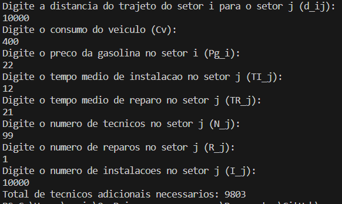

# Documentação do Algoritmo

# Introdução

A pesquisa operacional é um campo interdisciplinar que utiliza métodos matemáticos e algoritmos para resolver problemas complexos relacionados a processos e tomada de decisões eficientes em diversas áreas. Este documento apresentará três algoritmos iniciais, cada um projetado para resolver uma versão simplificada do problema em questão, baseado na modelagem matemática feita pelos autores.

# Algoritmos
Considerando que estes algoritmos são uma abordagem inicial para resolver versões simplificadas do problema, as soluções proporcionadas são viáveis. Porém, não é necessariamente a solução ótima global.
## Primeiro Algoritmo (Local Search):
### Visão Geral

O algoritmo implementa uma solução simplificada para a distribuição de técnicos em setores com base na demanda de serviços. Ele utiliza o algoritmo de Local Search para encontrar uma alocação eficiente de técnicos, utilizando como base os dados do mês de Setembro disponibilizados pela empresa, minimizando a diferença entre a capacidade dos técnicos e a demanda de serviços em cada setor.

### Modelagem Objetivo

O principal propósito é minimizar a disparidade entre a quantidade de serviços e o número de técnicos distribuídos, considerando a demanda mensal por serviços e reparos em diferentes setores. A função objetivo é formulada para calcular essa distribuição de maneira proporcional à demanda existente entre os setores, minimizando essa disparidade.

#### Restrições

- Cada técnico deve realizar pelo menos um serviço por dia.
- Cada técnico não pode exceder a quantidade de dois serviços diários realizados.
- O número de técnicos alocados não pode ser inferior à metade da quantidade total de serviços.
- O número de técnicos alocados não pode ultrapassar a quantidade total de serviços disponíveis.

### Componentes Principais

#### `Input` (Input.java)

A classe `Input` lida com a entrada de dados, permitindo ao usuário escolher entre as cidades de Maringá e Curitiba, para utilizar seus dados no algoritmo de alocação. Ela carrega os dados dos arquivos correspondentes e cria instâncias de `Setor` com base nesses dados.

#### `LocalSearch` (LocalSearch.java)

A classe `LocalSearch` implementa o algoritmo de otimização usando uma versão simplificada do Local Search. Ela ajusta a quantidade de técnicos em cada setor para otimizar a distribuição, considerando a demanda de serviços e a capacidade dos técnicos.

#### `Setor` (Setor.java)

A classe `Setor`  representa um setor com atributos como nome, quantidade de técnicos e quantidade de serviços. Implementa a interface `Comparable` para permitir a comparação entre setores com base na quantidade de serviços.

### Inicialização

O programa deve ser iniciado executando o método `main` na classe `LocalSearch`. O usuário escolherá entre as opções das cidades disponíveis, e o algoritmo será aplicado para otimizar a distribuição de técnicos pelos setores do local escolhido.

Trecho do método `main` na classe `LocalSearch`:
```java
public static void main(String[] args) {
    Input input = new Input();
    LocalSearch localSearch = new LocalSearch();
    localSearch.setSetores(input.getSetores());
    localSearch.otimizarDistribuicao();
    localSearch.mostrarResultados();
}
```

### Parâmetros

- **Número de Iterações para o Local Search:** O número de iterações para o algoritmo de Local Search pode ser ajustado na classe `LocalSearch` pela variável `iteracoes`.

- **Ajuste da Distribuição de Técnicos:** A lógica de restrição para ajustar a distribuição de técnicos pode ser personalizada no método `localSearch` na classe `LocalSearch`.

### Dependências

O projeto faz uso da biblioteca OpenCSV para processar arquivos CSV.

```xml
<dependency>
    <groupId>com.opencsv</groupId>
    <artifactId>opencsv</artifactId>
    <version>5.5</version> 
</dependency>
```

### Testes
1. **Teste 1:**
   - Entrada:
     - Escolha a cidade (Digite 1 para Maringá ou 2 para Curitiba): 1
   - Saída: Alocação utilizada pela empresa no mês de Setembro e a alocação sugerida pelo algoritmo

   Figura: Primeiro teste.

   

   Fonte: Captura de tela feita pelos autores.

   **Conclusão:** O algoritmo está alocando com base nas restrições, no entanto, se não considerar uma necessidade correspondente à quantidade total de técnicos, ele a ajusta para um valor inferior.

2. **Teste 2:**
   - Entrada:
     - Escolha a cidade (Digite 1 para Maringá ou 2 para Curitiba): 2
   - Saída: Alocação utilizada pela empresa no mês de Setembro e a alocação sugerida pelo algoritmo

   Figura: Segundo teste.

   

   Fonte: Captura de tela feita pelos autores.

   **Conclusão:** O algoritmo realiza alocações conforme as restrições, mas há situações em que são designados mais técnicos para setores com menor demanda. É necessário otimizar o algoritmo para buscar soluções mais ideais nessas circunstâncias.

3. **Teste 3:**
   - Entrada:
     - Escolha a cidade (Digite 1 para Maringá ou 2 para Curitiba): 6
   - Saída: Escolha inválida. Encerrando o programa.

   Figura: Terceiro teste.

   

   Fonte: Captura de tela feita pelos autores.

   **Conclusão:** O algoritmo somente será executado se um input válido for fornecido.


## Segundo Algoritmo (Algoritmo visando custo de deslocamento):


### Visão Geral

O algoritmo visa otimizar a alocação de técnicos da V.tal, minimizando o custo total de deslocamento entre setores. Considera-se tanto os custos de deslocamento quanto as demandas de instalações e reparos em diferentes setores. A função objetivo busca calcular o custo total ponderado pelo número de técnicos alocados.

### Modelagem Objetivo

O principal objetivo é minimizar o custo total de deslocamento dos técnicos, levando em consideração o tempo de deslocamento, o tempo necessário para instalações e reparos, e os custos monetários associados. A função objetivo é projetada para calcular esse custo total, considerando as demandas e a alocação de técnicos. 

#### Restrições

- O tempo de trabalho total não exceda a jornada diária de trabalho do técnico.
- O número de ordens de serviço não pode ultrapassar o dobro da quantidade de técnicos após a distribuição.

### Funcionamento do Código
#### Leitura de Parâmetros

O algoritmo inicia solicitando os parâmetros de entrada para o usuário através do terminal. Esses parâmetros incluem distâncias entre setores, consumo do veículo, preço da gasolina, tempo médio de instalação e reparo, além do número de técnicos, reparos e instalações em cada setor.

#### Cálculo de Alocação de Técnicos

O programa compara o número total de tarefas com a capacidade de trabalho dos técnicos existentes, assumindo que cada técnico pode realizar até duas tarefas por dia. Se o trabalho exceder essa capacidade, o algoritmo determina o número de técnicos adicionais necessários e armazena essa informação.

#### Resposta do Algoritmo

O algoritmo imprime no console o número de técnicos adicionais necessários, com base nos parâmetros fornecidos pelo usuário, para cada setor.

### Dependências

O projeto faz uso da biblioteca JUnit para implementar testes. 

```xml
<dependency>
    <groupId>junit</groupId>
    <artifactId>junit</artifactId>
    <version>4.11</version>
    <scope>test</scope>
</dependency>
```

### Testes
1. **Teste 1:**
   - Entrada:
     - Distância: 45
     - Consumo do veículo: 30
     - Preço da gasolina: {vazio}
     - Tempo médio de instalação: (não fornecido)
     - Tempo médio de reparo: (não fornecido)
     - Número de técnicos: (não fornecido)
     - Número de reparos: (não fornecido)
     - Número de instalações: (não fornecido)
   - Saída: Exception in thread "main"

   **Conclusão:** Na terceira requisição de input foi enviado um valor vazio (incompleto), levando a uma exceção.

   Figura: Primeiro teste.

   

   Fonte: Captura de tela feita pelos autores.

2. **Teste 2:**
   - Entrada:
     - Distância: 200
     - Consumo do veículo: 1
     - Preço da gasolina: 5
     - Tempo médio de instalação: 2
     - Tempo médio de reparo: 1
     - Número de técnicos: 50
     - Número de reparos: 50
     - Número de instalações: 100
   - Saída: Total de técnicos adicionais necessários: 50

   **Conclusão:** O algoritmo calcula corretamente quantos técnicos adicionais são necessários.

   Figura: Segundo teste.

   

   Fonte: Captura de tela feita pelos autores.

3. **Teste 3:**
   - Entrada:
     - Distância: 1
     - Consumo do veículo: 0
     - Preço da gasolina: 0.5
     - Tempo médio de instalação: (não fornecido)
     - Tempo médio de reparo: (não fornecido)
     - Número de técnicos: (não fornecido)
     - Número de reparos: (não fornecido)
     - Número de instalações: (não fornecido)
   - Saída: Exception in thread "main" java.util.InputMismatchException

   **Conclusão:** A saída levou a uma exceção após colocar um número não inteiro como entrada.

   Figura: Terceiro teste.

    

   Fonte: Captura de tela feita pelos autores.

4. **Teste 4:**
   - Entrada:
     - Distância: 10000
     - Consumo do veículo: 400
     - Preço da gasolina: 22
     - Tempo médio de instalação: 12
     - Tempo médio de reparo: 21
     - Número de técnicos: 99
     - Número de reparos: 1
     - Número de instalações: 10000
   - Saída: Total de técnicos adicionais necessários: 9803

   **Conclusão:** O algoritmo indica que são necessários muitos técnicos adicionais para cumprir a demanda.

   Figura: Quarto teste.

    

    Fonte: Captura de tela feita pelos autores.

5. **Teste 5:**
   - Entrada:
     - Distância: 0
     - Consumo do veículo: 0
     - Preço da gasolina: 0
     - Tempo médio de instalação: 0
     - Tempo médio de reparo: 0
     - Número de técnicos: 0
     - Número de reparos: 2
     - Número de instalações: 2
   - Saída: Total de técnicos adicionais necessários: 4

   **Conclusão:** O algoritmo está retornando a quantidade de técnicos 1 para 1 em relação aos setores, o que é considerada uma solução viável por estar dentro das restrições.

    Figura: Quinto teste.

    

    Fonte: Captura de tela feita pelos autores.


**Observações sobre os testes:**
- O código não aceita entradas que não sejam números inteiros.
- O código parece não lidar muito bem com entradas incompletas ou inválidas, gerando exceções.
- A entrada do consumo do veículo e do preço da gasolina deve ser tratada com cuidado para evitar exceções e garantir a robustez do programa.


## Terceiro Algoritmo (Simplex):
### Visão Geral
Esse algoritmo tem como objetivo minimizar a soma total das distâncias percorridas pelos técnicos multiplicadas pelo número de técnicos em deslocamento, resultando na minimização do custo total de deslocamento. Ao otimizar essa função, busca-se uma distribuição mais eficiente dos técnicos entre os setores, considerando a eficácia do deslocamento.

### Função Objetivo
Minimizar (ou Maximizar): A função objetivo é a expressão matemática que representa a quantidade que queremos otimizar. No nosso caso, estamos minimizando uma função objetivo, o que significa que estamos tentando encontrar o valor mínimo. A função objetivo é geralmente expressa como uma combinação linear das variáveis de decisão, ponderadas pelos coeficientes correspondentes. Por exemplo:

Minimize Z = c1 * x1 + c2 * x2 + c3 * x3 + ... + cn * xn

Onde Z é o valor que estamos tentando minimizar, c1, c2, ..., cn são os coeficientes das variáveis x1, x2, ..., xn, respectivamente.

#### Restrições
As restrições representam as limitações ou condições sob as quais o problema deve ser resolvido. As restrições são geralmente expressas como igualdades ou desigualdades lineares envolvendo as variáveis de decisão. Por exemplo: A1 * x1 + A2 * x2 + A3 * x3 + ... + An * xn <= b
Onde A1, A2, ..., An são os coeficientes das variáveis x1, x2, ..., xn nas restrições, e b é o limite superior das restrições.
No contexto do projeto as restrições são:
- A quantidade de técnicos que sai do setor i + a quantidade de técnicos que chega pro setor i tem que ser maior ou igual à demanda do setor;
- A quantidade de técnicos que fica no setor i + a quantidade de técnicos que sai do setor i para qualquer outro tem quer ser igual à quantidade inicial de técnicos nesse setor i.

#### Variáveis de Decisão:
As variáveis de decisão representam as quantidades que estamos tentando determinar. Elas são representadas por x1, x2, ..., xn em nosso modelo.

### Especificações

O algoritmo foi desenvolvido no Google Colaboratory por meio da linguagem Python.

### Testes
Os testes de programação linear são cenários específicos que envolvem problemas de alocação de recursos, como alocar técnicos em diferentes setores de atendimento. Cada teste é definido por:
- Distâncias entre Setores: As distâncias entre os setores de atendimento são especificadas para calcular o custo de alocação de técnicos entre eles. Isso influencia os coeficientes da função objetivo.
- Quantidade de Técnicos em Cada Setor: A quantidade de técnicos disponíveis em cada setor é importante para determinar as variáveis de decisão.
- Demanda de Cada Setor: A demanda de técnicos em cada setor de atendimento é uma restrição que deve ser satisfeita pelo modelo.
Para saber se o algoritmo está correto, fizemos um teste no solver do primeiro caso (Teste 1), onde conseguimos os mesmos resultados. Segue a imagem da resolução no google sheets:
   Figura: Teste no solver.

   

   Fonte: Captura de tela feita pelos autores.


1. **Teste 1:**

   Figura: Primeiro teste.

   

   Fonte: Captura de tela feita pelos autores.

2. **Teste 2:**

   Figura: Segundo teste.

   

   Fonte: Captura de tela feita pelos autores.

4. **Teste 3:**

   Figura: Terceiro teste.

   

   Fonte: Captura de tela feita pelos autores.

## Quarto algoritmo (o que será utilizado no projeto).

### Visão Geral
Esse algoritmo tem como objetivo minimizar o custo de deslocamento dos técnicos. Ele cria k clusters, onde k é o número total de chamados dividido pela produtividade média (quantos chamados um técnico consegue atender em um 1 dia). Com isso, a gente define os conjuntos de chamados mais próximos um do outro, para depois focar em alocar 1 técnico para cada conjunto (pois o técnico conseguirá realizar todos esses chamados), visando minimizar a distância total percorrida do técnico até o centro do cluster. Posteriormente é interessante que também aloquemos a ordem de chamados que cada técnico irá seguir. 

### Função Objetivo
Minimizar (ou Maximizar): A função objetivo é a expressão matemática que representa a quantidade que queremos otimizar. No nosso caso, estamos minimizando uma função objetivo, o que significa que estamos tentando encontrar o valor mínimo. A função objetivo é geralmente expressa como uma combinação linear das variáveis de decisão, ponderadas pelos coeficientes correspondentes. Por exemplo:

Minimize $Z = ∑(∑(D_{ij} * X_{ij}))$

onde:
- `D_{ij}` representa a distância que o técnico `i` deve percorrer para alcançar o centro do cluster `j`.
- `X_{ij}` é uma variável binária que indica se o técnico `i` é alocado ao cluster `j` (1 se alocado, 0 caso contrário).


#### Restrições
1. **Restrição de Alocação Única:**
- Cada técnico é alocado a apenas um cluster.
$∑(X_{ij}) = 1$, para cada técnico i
onde `i` varia sobre todos os técnicos.

2. **Restrição de Capacidade do Cluster:**
- Cada cluster não pode ter mais técnicos alocados do que sua capacidade máxima.
$∑(X_{ij}) ≤ C_j$, para cada cluster j
onde `C_j` representa a capacidade máxima do cluster `j`.

3. **Restrição de Distância Máxima:**
- A distância percorrida por cada técnico não pode exceder um limite máximo.
$D_{ij} ≤ D_{max}$, para cada técnico i e cluster j
onde `D_{max}` é a distância máxima permitida.

4. **Restrição de Atendimento de Todos os Chamados:**
- Todos os chamados devem ser atendidos por um técnico.
$∑(X_{ij}) = 1$, para cada chamado k

5. **Restrição de Continuidade Operacional:**
- Os técnicos devem operar dentro dos limites de tempo e capacidade.
$T_i + ∑(T_{k}) ≤ T_{max}$, para cada técnico i
onde `T_i` é o tempo de deslocamento do técnico `i` e `T_{k}` o tempo de atendimento do chamado `k`, e `T_{max}` é o tempo máximo de trabalho diário.

6. **Restrição de Integridade:**
- As variáveis de decisão devem ser binárias ou inteiras conforme definido.
$X_{ij} ∈ {0, 1}$

#### Variáveis de Decisão:
1. **Alocação de Técnicos aos Clusters (`X_{ij}`):**
   - Variável binária.
   - `X_{ij} = 1` se o técnico `i` é alocado ao cluster `j`.
   - `X_{ij} = 0` caso contrário.

2. **Deslocamento do Técnico (`D_{ij}`):**
   - Variável contínua.
   - Distância percorrida pelo técnico `i` para atingir o centro do cluster `j`.