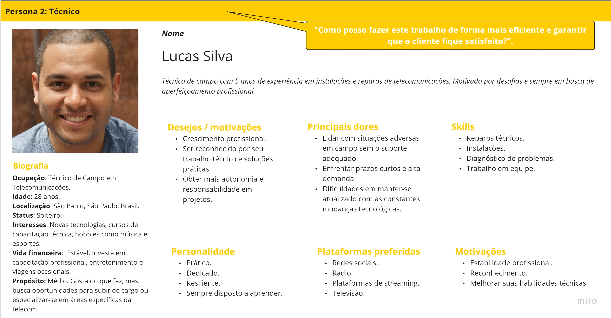

# Entendimento da experiência do usuário

## Personas
Uma persona é uma representação semi-fictícia de seu cliente ideal, baseada em dados reais e insights sobre comportamentos, motivações, dores e aspirações de seus consumidores. Ela é uma ferramenta crucial no mundo do marketing e do design, funcionando como uma espécie de guia para a criação de produtos, serviços e estratégias de comunicação mais assertivas e alinhadas às reais necessidades e desejos do público-alvo.

Nesse sentido, ela é extremamente importante pois possui a capacidade de humanizar e segmentar o público de uma empresa, permitindo que equipes de marketing, vendas e desenvolvimento compreendam melhor quem são seus clientes e o que eles realmente valorizam. Dessa forma, as empresas conseguem criar experiências mais personalizadas, relevantes e impactantes, aumentando, assim, a probabilidade de sucesso em suas ações e a satisfação dos clientes. Além disso, a utilização de personas ajuda a evitar esforços genéricos ou dispersos, direcionando recursos e energias de forma mais eficaz.

Nesse contexto, foram elaboradas duas personas para o projeto: a do Coordenador, que utilizará a solução diariamente, e a do Técnico. No entanto, embora o Técnico não vá interagir diretamente com a solução, é vital entendê-lo, uma vez que é diretamente impactado pelo projeto.

Figura 1: Persona 1 - Coordenador

 

Fonte: Elaboração dos autores

 

Figura 2: Persona 2 - Técnico

 

Fonte: Elaboração dos autores

 

Para melhor visualização das personas, é possível acessá-las através do link no Miro: <a href="https://miro.com/app/board/uXjVNZL3tJU=/?share_link_id=422304533797">clique aqui.</a>

## Mapa de empatia

O mapa de empatia é uma ferramenta de design thinking que serve como um guia visual para entender profundamente a experiência e perspectiva de um usuário. Através dele, é possível desvendar as emoções, necessidades, motivações e obstáculos que o usuário enfrenta, permitindo que seja possivel se aprofundar na mente e no coração dos usuários-alvo. 

Nesse sentido, sua importância reside na capacidade de cultivar empatia, um entendimento genuíno do usuário, que é a pedra angular de qualquer solução centrada no usuário. Assim, ao utilizar o mapa de empatia, é possível identificar oportunidades não reconhecidas, desenvolver soluções mais relevantes e, consequentemente, criar produtos e serviços que verdadeiramente atendam às necessidades e desejos de seus usuários.

Dessa forma, foi criado um mapa de empatia para cada persona no projeto, que é o coordenador de operações e o técnico.

Figura 1: Mapa de empatia do coordenador

 

  
  
  
Figura 2: Mapa de empatia do tecnico

 

Fonte: Elaboração dos autores

 
Para melhor visualização das imagens, é possível acessar o link na plataforma Miro: <a href="https://miro.com/app/board/uXjVNZL3tJU=/?share_link_id=67659850750">clique aqui</a>.

## Jornada do Usuário

A Jornada do Usuário é uma representação visual ou narrativa que descreve as etapas e experiências de um usuário ao interagir com um produto ou serviço. Ela permite que empresas compreendam as necessidades, sentimentos e desafios enfrentados pelo usuário, identifiquem pontos de melhoria e otimizem a experiência oferecida. Esta ferramenta é crucial para criar estratégias de marketing, design e vendas eficazes, com foco na satisfação e retenção de clientes.

Figura: Jornada do Coordenador de Operações.

Fonte: Desenvolvida pelos autores [na plataforma canva](https://www.canva.com/design/DAFyORjRHio/_bFKF5zTq2z075E-dptu9A/edit?utm_content=DAFyORjRHio&utm_campaign=designshare&utm_medium=link2&utm_source=sharebutton).

  ## User Stories

As User Stories foram mapeadas e implementadas em formato tabular com um critério de sucesso para cada user story. Nesse sentido, foram ordenadas pelo grau de prioridade, de maior para menor, onde 5 significa essencial e 1 como opcional. Além disso, foram categorizadas por tópicos principais.

| Tópico                  | User Story                                                                                                                                                                    | Critério de Sucesso                                                                                                                      | Prioridade |
|-------------------------|-------------------------------------------------------------------------------------------------------------------------------------------------------------------------------|------------------------------------------------------------------------------------------------------------------------------------------|------------|
| Otimização e Distribuição | Como coordenador de operações, quero acionar facilmente o algoritmo de otimização para simplificar e agilizar o processo de alocação dos técnicos. | A distribuição otimizada é gerada a partir do clique de um botão.                                                                        | 5          |
| Otimização e Distribuição | Como coordenador de operações, quero que o algoritmo de otimização leve em consideração os slots de 4 horas, a quantidade de técnicos, a quantidade de chamados e configuração pré-definida dos setores para minimizar o custo associado às mudanças de setores dos técnicos. | A distribuição otimizada reflete todas as considerações listadas e cumpre os SLAs estabelecidos.                                          | 5          |
| Plataforma               | Como coordenador de operações, quero visualizar a distribuição otimizada em formato tabular e em mapa para ter uma visão clara da distribuição e planejar ações.            | A distribuição otimizada é exibida tanto em formato tabular quanto em mapa, com setores atuais exibidos com detalhes.                    | 5          |
| Plataforma               | Como coordenador de operações, quero importar os dados de demanda para a plataforma para atualizar a base de dados e facilitar a entrada dos dados para execução do algoritmo. | Dados importados são refletidos corretamente no sistema e disponíveis para análise e otimização.                                         | 5          |
| Plataforma               | Como coordenador de operações, quero poder exportar os dados da distribuição para análises externas ou relatórios.                                                           | Os dados da distribuição são exportados com sucesso em formato tabular.                                                                 | 5          |
| Plataforma               | Como coordenador de operações, quero ter acesso ao embasamento matemático dos algoritmos da solução para compreender a lógica por trás das decisões e justificar escolhas.   | Documentação ou artigo detalhando o embasamento matemático dos algoritmos é fornecido e é claro e compreensível.                         | 5          |
| Plataforma               | Como coordenador de operações, quero que as cores da plataforma sejam compatíveis com o guia de estilos da V.Tal para manter a identidade visual da empresa.                 | A paleta de cores da plataforma é consistente com o guia de estilos da V.Tal.                                                           | 4          |
| Plataforma               | Como coordenador de operações, quero acessar o manual de uso da plataforma para entender todas as funcionalidades disponíveis.                                               | O manual de uso é acessível, claro e fornece informações detalhadas sobre todas as funcionalidades da plataforma.                        | 4          |
| Plataforma               | Como coordenador de operações, quero que as informações de input e solução sejam armazenadas em um banco de dados para manter um histórico e realizar análises futuras.       | Todas as informações de input e solução são armazenadas com sucesso, podendo serem acessadas quando necessário.                          | 4          |
| Otimização e Distribuição | Como coordenador de operações, quero obter a resposta da solução em, no máximo, 5 minutos para agilizar o processo de tomada de decisão.                                    | A solução é gerada e exibida em menos de 5 minutos após a solicitação, considerando a quantidade média de 5000 técnicos e 20000 chamados. | 3          |
| Relatórios e Análises    | Como coordenador de operações, quero gerar relatórios de desempenho com gráficos para avaliar a eficácia da distribuição e identificar áreas de melhoria da solução atual.  | Relatórios gerados fornecem insights claros sobre o desempenho da distribuição.                                                         | 1          |

  
 ## Análise de acessibilidade

Para garantir um design e funcionalidades inclusivos em nossa plataforma, baseamos uma análise de acessibilidade nas diretrizes da WCAG (Web Content Accessibility Guidelines) para nos guiar na elaboração da solução.

### Alternativas de texto para conteúdo não textual: 
- Equivalentes curtos para imagens, incluindo ícones, botões e gráficos, beneficiando pessoas com deficiência visual ou aquelas que usam leitores de tela.
- Descrição dos dados representados em gráficos, diagramas e ilustrações. Caso tenhamos um mapa, deverá haver uma descrição do mesmo.
- Breves descrições de conteúdo não textual, como arquivos de áudio e vídeo.
- Rótulos para controles de formulário, entrada e outros componentes da interface do usuário.

### O conteúdo pode ser apresentado de diferentes maneiras:
- Títulos, listas, tabelas, campos de entrada e estruturas de conteúdo devem ser marcados corretamente, beneficiando pessoas com diferentes necessidades e preferências.
- As sequências de informações ou instruções devem ser independentes de qualquer apresentação.
- Navegadores e tecnologias assistivas devem fornecer configurações para personalizar a apresentação.

### O conteúdo deve ser mais fácil de ver e ouvir:

- A cor não pode ser usada como única forma de transmitir informações ou identificar conteúdo, sendo crucial para usuários com deficiência visual.
- As combinações padrão de cores de primeiro plano e de fundo devem fornecer contraste suficiente.
- Quando os usuários redimensionam o texto em até 400% ou alteram o espaçamento do texto, nenhuma informação pode ser perdida.
- O texto deve refluir em janelas pequenas (“viewports”) e, quando os usuários aumentam o texto, as imagens de texto devem ser redimensionadas, substituídas por texto real ou evitadas sempre que possível.

### A funcionalidade deve estar disponível a partir de um teclado:
- Todas as funcionalidades disponíveis pelo mouse também devem estar disponíveis pelo teclado, beneficiando usuários que não podem usar um mouse ou dispositivo apontador.
- O foco do teclado não pode ficar preso em nenhuma parte do conteúdo.
- Navegadores da Web, ferramentas de autoria e outras aplicações devem fornecer suporte para teclado.

### O conteúdo não pode causar convulsões ou reações físicas:
- Não incluir conteúdo que pisca em taxas e padrões específicos, protegendo usuários com condições como epilepsia fotossensível.
- Avisar os usuários antes que o conteúdo flash seja apresentado e fornecer alternativas.
- Fornecer mecanismos para desligar animações, a menos que sejam essenciais.

### Os usuários podem navegar facilmente, encontrar conteúdo e determinar onde estão:
- As páginas têm títulos claros e são organizadas usando títulos de seção descritivos, essencial para a orientação de todos os usuários, especialmente aqueles com deficiências cognitivas.
- Existe mais de uma maneira de encontrar páginas relevantes em um conjunto de páginas da web.
- Os usuários são informados sobre sua localização atual em um conjunto de páginas relacionadas.
- Existem maneiras de contornar blocos de conteúdo repetidos em várias páginas.
- O foco do teclado é visível e a ordem do foco segue uma sequência significativa.
- A finalidade de um link é evidente, de preferência mesmo quando o link é visualizado por si só.

### Os usuários podem usar diferentes modalidades de entrada além do teclado
- Gestos que exigem destreza ou movimentos finos têm alternativas que não exigem alta destreza.
- Os componentes são projetados para evitar ativação acidental, por exemplo, fornecendo funcionalidade de desfazer.
- Os rótulos apresentados aos usuários correspondem aos nomes dos objetos correspondentes no código, para suportar a ativação por voz.
- A funcionalidade ativada pelo movimento também pode ser ativada por meio de componentes da interface do usuário.
- Botões, links e outros componentes ativos são grandes o suficiente para facilitar sua ativação por toque.

