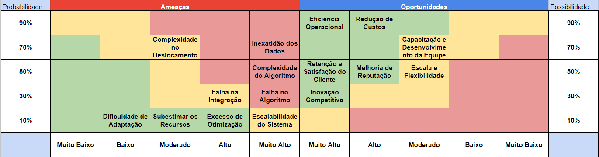
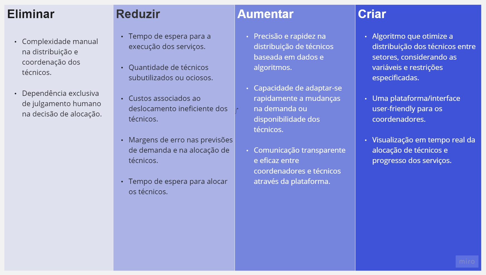

# Entendimento de negócio

## Stakeholders do projeto

Stakeholders são indivíduos, grupos ou organizações que têm interesse em um projeto, processo ou decisão e podem ser afetados por ele ou influenciar seu resultado, seja diretamente ou indiretamente. O mapeamento de stakeholders é uma etapa crucial em qualquer projeto, pois permite identificar e entender as partes interessadas, suas necessidades, preocupações e o impacto que o projeto pode ter sobre elas. Ao compreender e envolver os stakeholders de maneira adequada, é possível garantir que o projeto seja desenvolvido de forma alinhada com as expectativas e necessidades de todos os envolvidos, minimizando riscos e potencializando o sucesso da iniciativa.

### 1. Área de Operações
#### **Marcelo Boff de Souza (VP de Operações)**
**Papel:** Supervisionar toda a área de operações, garantindo que os processos estejam alinhados com os objetivos estratégicos da empresa.
**Interesse:** Garantir que o projeto de otimização resulte em economia de custos, melhoria nos SLAs e satisfação do cliente.
#### Roberto Pereira (Gerente de Operações)

**Papel:** Gerenciar a equipe de operações e a força de campo, garantindo que os técnicos sejam distribuídos de forma eficiente.
**Interesse:** Ter uma ferramenta que facilite a gestão e otimização dos técnicos, melhorando a eficiência operacional e atendendo aos SLAs.
### 2. Área de TI
#### Sandro Simas (VP de TI)

**Papel:** Supervisionar toda a área de TI, garantindo que os sistemas e projetos estejam alinhados com os objetivos estratégicos da empresa.
**Interesse:** Garantir que a plataforma de otimização seja robusta, segura e eficaz.
#### Gisele Hinz e Fabricio Metzker (Diretores de TI)

**Papel:** Supervisionar projetos específicos dentro da área de TI, garantindo que sejam entregues no prazo e dentro do escopo.
**Interesse:** Ter uma comunicação clara com os alunos sobre os requisitos e expectativas do projeto, garantindo que a solução desenvolvida atenda às necessidades da empresa.
### 3. Alunos
#### Arthur Nisa, Esther Hikari, Mariana Görresen, Thomaz Klifson, Tony Jonas e Henrique Burle
**Papel:** Desenvolver e implementar a solução de otimização.
**Interesse:** Entender claramente os requisitos e expectativas do projeto, desenvolver uma solução robusta e eficaz, e garantir a satisfação dos stakeholders.
### 4. Orientador
#### Tomaz Mikio Sasaki
**Papel:** Orientar os alunos durante o desenvolvimento do projeto, facilitando a comunicação entre os alunos e os stakeholders da empresa.
**Interesse:** Garantir que o projeto seja desenvolvido de acordo com os padrões acadêmicos e profissionais, e que os alunos aprendam e se desenvolvam durante o processo.

## Perfil dos concorrentes

A análise do perfil dos concorrentes é uma ferramenta estratégica essencial para qualquer empresa que busca manter ou expandir sua posição no mercado. Ao entender as forças, fraquezas, oportunidades e ameaças dos concorrentes, uma empresa pode identificar lacunas no mercado, ajustar sua estratégia e tomar decisões informadas para garantir sua vantagem competitiva. Para aprofundar nossa compreensão do mercado de fibra ótica, consideramos o perfil de várias empresas líderes no segmento, incluindo FiBrasil, On Net Fibra Colômbia, On Net Fibra Chile e I-Systems.

### FIBRASIL

A FiBrasil é uma joint venture entre a Telefônica e o fundo canadense CDPQ, criada em 2021. Com um backbone de fibra de 25 mil km, a empresa tem planos de atingir 6 milhões de casas até 2024. A FiBrasil já fechou contratos significativos com empresas como Vrio e Vero Internet, solidificando sua posição no mercado. O investimento do CDPQ na FiBrasil é uma indicação clara do potencial de crescimento da empresa no setor de fibra ótica. Além de sua oferta principal de fibra ótica, a FiBrasil, através da Telefônica, pode oferecer uma variedade de serviços de telecomunicações, soluções de TI e serviços digitais, proporcionando uma oferta mais abrangente aos seus clientes.

### ON NET FIBRA COLÔMBIA

Originada em 2022, a On Net Fibra Colômbia foi criada após a venda do controle da rede de fibra da Telefónica Colômbia para o fundo norte-americano KKR. Com metas claras, a empresa planeja atingir 4,3 milhões de casas até 2024. A empresa tem uma forte parceria com a Telefónica, que é tanto sua acionista quanto seu principal cliente. A On Net Fibra Colômbia está em uma fase de rápido crescimento, buscando expandir sua presença no mercado colombiano. Com a Telefónica como parceira, a On Net Fibra Colômbia tem potencial para diversificar seus serviços, incluindo soluções de telecomunicações avançadas e serviços digitais, ampliando seu alcance no mercado.

### ON NET FIBRA CHILE

A On Net Fibra Chile é uma joint venture entre a Telefonica e a KKR, com uma rede impressionante de 40 mil km de backbone de fibra. A empresa tem planos ambiciosos de expansão, com um investimento de US\$ 220 milhões previsto para os próximos cinco anos. A recente aquisição da rede de fibra ótica da Entel por US\$ 360 milhões indica a determinação da empresa em dominar o mercado chileno de fibra ótica. Além disso, a parceria com a Telefonica permite à On Net Fibra Chile oferecer uma gama diversificada de serviços, desde telecomunicações até soluções digitais, tornando-a uma força a ser reconhecida no mercado chileno.

### I-SYSTEMS

A I-Systems é uma colaboração entre a IHS Towers e a TIM, focada principalmente no mercado brasileiro. Com 4,3 milhões de casas passadas com fibra, a empresa tem a TIM como seu principal cliente. A I-Systems tem potencial para expandir sua presença, especialmente considerando os planos da TIM de atingir 8,9 milhões de instalações passadas com fibra até 2024. Além da infraestrutura de fibra, a parceria com a TIM pode permitir à I-Systems explorar outros serviços relacionados à telecomunicação, como telefonia móvel, soluções de TI e serviços digitais, proporcionando uma oferta mais holística ao mercado.

## Canvas Proposta de Valor
O Canvas Proposta de Valor é uma ferramenta extremamente útil no desenvolvimento de projetos e na estratégia de negócios, especialmente quando se trata de entender as necessidades dos clientes e criar ofertas de valor que sejam verdadeiramente atraentes para eles.

O Canvas da Proposta de Valor é dividido em dois componentes principais:

1. **Perfil do Cliente**: O foco é compreender a realidade do cliente, entendendo as tarefas que ele procura realizar (sejam elas essenciais ou secundárias), as dores que experimenta (frustrações ou obstáculos em sua jornada) e os ganhos que almeja (os resultados e benefícios desejados). Este insight é fundamental para além de atender, superar as expectativas do cliente.

2. **Mapa de Proposta de Valor**: Esta seção do canvas é onde a proposta de resolução do problema é mostrada, estruturando os produtos e serviços para aliviar as dores e facilitar os ganhos, complementando as necessidades e desejos identificados no perfil do cliente. Assim, garantindo uma proposta de valor coesa e focada no problema.

Na ilustração abaixo, apresentamos um Canvas da Proposta de Valor preenchido, que reflete uma compreensão aprofundada e uma análise estratégica do perfil do parceiro em relação ao problema que buscamos resolver.

**Figura**: Template preenchido com o Canvas Proposta de Valor do projeto.

**Fonte**: Desenvolvido pelos autores [na plataforma Miro](https://miro.com/app/board/uXjVNZY9PVg=/?share_link_id=971052467027).

## Matriz de Risco
A matriz de risco é uma ferramenta fundamental na gestão de projetos, muito utilizada na análise de riscos e tomada de decisões. Ela funciona mapeando a probabilidade de ocorrência de um risco contra seu nível de impacto. Essa metodologia ajuda a identificar, qualificar e priorizar riscos, permitindo que sejam desenvolvidos planos de resposta eficazes. Através desta análise, é possível focar os recursos em mitigar os riscos que são mais prováveis de acontecer e que teriam um impacto mais severo no projeto.

No contexto desse projeto, foi reconhecida a necessidade de uma forma de gerenciar essas incertezas e garantir que os riscos fossem discutidos e administrados de forma adequada. Portanto, foi criada uma matriz de risco específica para o projeto, levando em consideração todos os fatores e variáveis relevantes. Com esta matriz, é possível uma visão clara dos potenciais riscos, podendo antecipar problemas, priorizar riscos de maior importância, e desenvolver estratégias para lidar com eles, garantindo que o projeto seja executado de forma mais eficiente e com a maior probabilidade de sucesso.

Figura 1: Matriz de risco do projeto

Fonte: Desenvolvido pelos autores, [através do Excel](https://docs.google.com/spreadsheets/d/1xaQ6SagRE1JT3tGhleJSn_bPBrRO7zGt/edit?usp=sharing&ouid=105206228855947602384&rtpof=true&sd=true).

Ameaça                      | Probabilidade | Impacto      | Justificativa                                                                             | Como mitigar |
----------------------------|---------------|--------------|-------------------------------------------------------------------------------------------|--------------|
Inexatidão dos Dados        | 70%            | Muito Alto   | Dados incorretos ou desatualizados podem levar a decisões de alocação ineficientes.        | Realizar verificações regulares da integridade dos dados e implementar processos de validação. |
Complexidade no Deslocamento| 70%            | Moderado     | O deslocamento de técnicos entre cidades pode ser mais complexo do que o previsto.        | Planejar rotas com antecedência, considerando as variáveis locais e gerenciando bem as rotas. |
Complexidade do Algoritmo   | 50%             | Muito Alto   | O algoritmo é complexo, tornando difícil a manutenção e ajustes.                          | Investir em  uma documentação detalhada e em treinamento especializado para a equipe de TI. |
Falha no Algoritmo          | 30%             | Muito Alto   | Problemas técnicos podem levar a decisões ineficientes.                                   | Testar extensivamente antes da implementação e ter um sistema de backup atualizado e em funcionamento. |
Falha na Integração         | 30%             | Alto         | Falha na integração pode tornar o algoritmo inutilizável.                                 | Testar as integrações regularmente e monitorar a comunicação entre sistemas. |
Excesso de Otimização       | 10%             | Alto         | O sistema pode priorizar eficiência de maneira que prejudique outros aspectos.            | Estabelecer critérios claros de otimização e monitorar os resultados para balanceamento. |
Escalabilidade do Sistema   | 10%             | Alto         | Limitações na escalabilidade podem afetar a capacidade de atendimento.                    | Investir em infraestrutura escalável e monitorar a demanda continuamente. |
Dificuldade de Adaptação    | 10%             | Baixo        | Dificuldade ao adaptar a equipe para o uso da plataforma.                                 | Estabelecer programas de treinamento e suporte contínuo para a equipe. |
Subestimar os Recursos      | 10%             | Moderado     | Subestimação pode levar a atrasos e clientes insatisfeitos.                               | Manter uma análise contínua das necessidades de recursos e ajustar conforme necessário. |

Oportunidade                            | Probabilidade | Impacto      | Justificativa  |
----------------------------------------|---------------|--------------|----------------|
Eficiência Operacional                  | 90%             | Muito Alto   | A implementação bem-sucedida do algoritmo pode melhorar significativamente a distribuição, produtividade e eficácia dos técnicos, otimizando o processo como um todo. |
Redução de Custos                       | 90%             | Alto         | A otimização da distribuição e alocação dos técnicos pode levar à redução de horas extras, deslocamentos desnecessários e outros gastos operacionais. |
Capacitação e Desenvolvimento da Equipe | 70%             | Moderado     | O uso de tecnologia avançada e novos processos pode proporcionar oportunidades de aprendizado e desenvolvimento para a equipe técnica e gerencial. |
Retenção e Satisfação do Cliente        | 50%             | Muito Alto   | Melhorando os SLAs e a eficiência dos serviços, podemos aumentar a satisfação do cliente, levando a uma maior retenção e lealdade. |
Melhoria de Reputação                   | 50%             | Alto         | A otimização dos serviços e a capacidade de cumprir ou exceder os SLAs podem melhorar a imagem da empresa no mercado, atraindo mais negócios e parceiros. |
Escala e Flexibilidade                  | 50%             | Moderado     | Ao ter um sistema adaptável e escalável, a empresa estará melhor preparada para atender demandas crescentes e mudanças no mercado. |
Inovação Competitiva                    | 30%             | Muito Alto   | Ao se posicionar na linha de frente da tecnologia e da otimização, a empresa tem a oportunidade de conquistar uma posição de destaque no mercado, destacando-se ainda mais da concorrência. |

## Matriz do Oceano Azul: Uma Visão Geral e Sua Importância

Introduzida por W. Chan Kim e Renée Mauborgne no livro "A Estratégia do Oceano Azul", a Matriz do Oceano Azul propõe uma abordagem estratégica centrada na criação de novos espaços de mercado, em vez de competir nos espaços já saturados.

Em contraste com o **Oceano Vermelho**, no qual as empresas batalham em mercados altamente concorridos, o **Oceano Azul** direciona-se para setores não explorados e oportunidades de mercado ainda não saturadas. A matriz guia as empresas por meio de quatro ações fundamentais:

1. **Eliminar**: Descartar fatores da indústria que se tornaram irrelevantes.
2. **Reduzir**: Diminuir fatores que estão sendo superdimensionados.
3. **Elevar**: Valorizar fatores que foram subestimados ou negligenciados.
4. **Criar**: Introduzir novas características ou ofertas que podem gerar demanda.

A matriz ganha destaque por sua habilidade em conduzir as empresas rumo à inovação e diferenciação. Ela motiva as organizações a pensar além da competição, incentivando-as a criar valor singular para os consumidores. Ao fazer isso, torna-se possível alcançar crescimento e lucratividade sustentados. 

Para efeito de comparação, foi analisada a solução concorrente 'Routeasy', principal player nesse mercado, que possui um software roteirizador de rotas automatizado, visando reduzir custos operacionais, economizar tempo e melhorar a eficiência geral, podendo ser acessado através de aplicativo e API. Dessa forma, a seguir, apresentaremos a matriz do oceano azul, aplicada à V.Tal, em detalhes:

## Introdução à Análise PESTEL

A análise PESTEL é uma ferramenta estratégica abrangente e vital, utilizada por empresas e negócios para identificar e avaliar fatores macroambientais externos que podem impactar o plaejamento da empresa. O termo PESTEL é um acrônimo para os seis fatores que são analisados: 

- **P**olítico
- **E**conômico
- **S**ocial
- **T**ecnológico
- **E**cológico (ou Ambiental)
- **L**egal

Ao analisar cada um desses fatores, as organizações podem obter insights valiosos sobre as tendências, oportunidades e ameaças no ambiente externo em que operam. Compreender esses fatores macroambientais é crucial para planejar e tomar decisões estratégicas informadas, bem como para antecipar possíveis desafios e se adaptar às mudanças no ambiente de negócios. A análise PESTEL permite que as empresas se posicionem de forma proativa, em vez de reativa, frente às variáveis do ambiente em que estão inseridas.

## Análise Financeira do Projeto

### Economia de Tempo para Técnicos:

**Racional:** Ao otimizar o processo de trabalho dos técnicos e alcançar uma melhoria almejada de 15% em sua eficiência, um técnico que antes completava 10 chamadas em um mês agora pode completar 11,5 chamadas no mesmo período.

#### Impacto Quantitativo:

- Um técnico realiza, em média, 2 chamadas por dia, totalizando 10.000 chamadas diárias para os 5.000 técnicos.
- Considerando 22 dias úteis por mês, são realizadas 220.000 chamadas mensais.
- Com um aumento de produtividade de 15%, seriam necessários apenas 4.348 técnicos para realizar o mesmo trabalho, uma redução de 652 técnicos.

#### Impacto Financeiro:

- Salário médio de um técnico: R$3.000.
- Economia mensal: 652 técnicos x R$3.000 = R$1.956.000.
- Economia anual: R$1.956.000 x 12 = R$23.472.000.

### Economia de Tempo para Planejadores:

**Racional:** Ao otimizar o processo de trabalho dos planejadores e economizar 20% do seu tempo, a eficiência de um planejador otimizado equivale a 1,2 planejadores não otimizados. Assim, quatro planejadores otimizados podem realizar o trabalho que cinco fariam anteriormente.

#### Impacto Quantitativo:

- Com 72 planejadores originais e uma eficiência 20% maior, seriam necessários apenas 60 planejadores, uma redução de 12 planejadores.

#### Impacto Financeiro:

- Salário médio de um planejador: R$4.000.
- Economia mensal: 12 planejadores x R$4.000 = R$48.000.
- Economia anual: R$48.000 x 12 = R$576.000.

Dessa forma, a implementação da solução proposta pode resultar em economias significativas para a empresa. A otimização dos processos não apenas melhora a eficiência operacional, mas também tem um impacto financeiro direto. No melhor cenário, a economia anual estimada para técnicos e planejadores é de R$24.048.000, o que destaca o potencial retorno sobre o investimento ao adotar a solução.

### Custo de Desenvolvimento do Projeto

Para calcular o custo de desenvolvimento do projeto, não consideramos o custo de manuntenção, e sim apenas de desenvolvimento. Para isso, consideramos o número de profissionais envolvidos, seus salários e a duração do projeto.

**Racional:** O grupo é composto por 6 pessoas, entre programadores e designers, com um salário médio de R$1.200 por semana. Como o projeto tem uma duração total de 10 semanas, podemos calcular o custo total multiplicando o salário semanal pelo número de semanas e pelo número de profissionais. Além disso, é preciso considerar o custo além do salário que um funcionário recebe diretamente, como por exemplo FGTS, INSS, Seguro Acidente de Trabalho (SAT), entre outros, o que dá uma média de 70% a mais. 

#### Cálculo:

- Custo de salário semanal para o grupo: 6 pessoas x R$1.200 = R$7.200.
- Custo de salário semanal contando com outros custos: R$12.240.
- Custo total do projeto: R$7.200 x 10 semanas = R$124.400.

Dessa forma, seria cobrado um total de R$124.400 para desenvolver o projeto ao longo de 10 semanas.