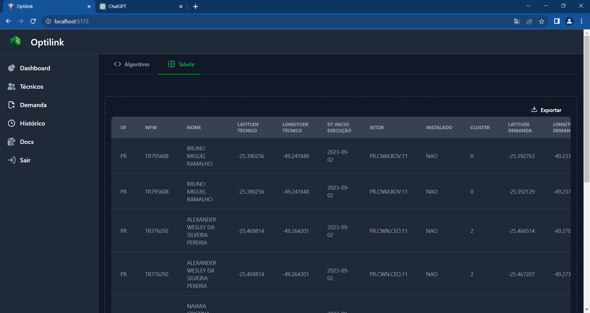

# Relatório de Teste da Aplicação
Este documento apresenta os resultados dos testes realizados na aplicação, enfocando os cenários essenciais identificados.

## Instruções para rodar a Aplicação
Entre no [link](instrucoes_de_ambiente.md) para configurar sua máquina e rodar a Aplicação.

## Página de Técnicos

### Importar os dados de técnicos

Ao clicar no botão `Importar`, localizado no canto superior direito da tela, um pop-up do explorador de arquivos será exibido. Esta funcionalidade permite ao usuário selecionar e importar os dados dos técnicos diretamente para a aplicação. O processo é intuitivo e facilita a inserção rápida.

Figura: Processo de input dos dados ao apertar em `Importar`.

### Visualizar dados de técnicos

Uma vez que os dados são inseridos através do processo de importação, é necessário que o usuário atualize a página e, assim, poderá visualizar todos os técnicos cadastrados na tabela dedicada, localizada na página de técnicos. Esta tabela oferece uma visão clara e organizada, permitindo fácil acesso e análise das informações dos técnicos.

Figura: Visualização dos dados de técnicos na tabela.

## Página de Demandas

### Importar os dados de demandas das cidades

Ao clicar no botão `Importar`, localizado no canto superior direito da tela, um pop-up do explorador de arquivos será exibido. Esta funcionalidade permite ao usuário selecionar e importar os dados das demandas de serviços diretamente para a aplicação. 

Figura: Processo de input dos dados ao apertar `Importar`.

### Visualização de quais cidades com demandas estão cadastradas

Uma vez que os dados de demanda de uma específica cidade são inseridos no processo de importação, é necessário que o usuário atualize a página de demandas para visualizar uma lista atualizada das cidades com demandas cadastradas, incluindo informações sobre quando estas foram inseridas ou atualizadas pela última vez. Para garantir a precisão e a relevância das informações, a aplicação opera com um mecanismo de atualização contínua: sempre que houver a necessidade de atualizar as demandas de serviços de uma determinada cidade, os registros antigos serão automaticamente removidos e substituídos pelos novos. 

Figura: Lista de demandas cadastradas.

## Página Dashboard

### Rodar o Algoritmo

Para rodar o algoritmo, é necessário clicar no botão `Rodar Algoritmo`, localizado no anto superior direito da tela. Ao clicar, abrirá um modal com as opções de estado, cidade e data em que o usuário deseja que o algoritmo rode para indicar a alocação ideal. Após escolher as opções nos filtros, é só clicar em `Calcular Alocação`, e esperar o modal fechar automaticamente. 

Figura: Processo de filtragem de opções para rodar o algoritmo.

### Visualizar alocação indicada pelo algoritmo

No canto superior esquerdo do dashboard, o usuário encontrará duas opções: `Algoritmo` (a visualização inicial com o mapa) e `Tabela`. Após a execução e o cálculo do algoritmo, seguido do fechamento do modal automático, o mapa carregará de forma visual a localização dos técnicos e das demandas, que ao serem selecionadas mostrarão os parâmetros sugeridos na alocação. Ao selecionar a opção `Tabela`, será exibida nesta seção a alocação ideal, em formato tabular, sugerida pelo algoritmo desenvolvido pelos autores.  Enquanto o usuário não tiver rodado o algoritmo, a tabela e o mapa se encontrarão vazios.

Inputs ao rodar o algoritmo: 
Estado: PR |
Cidade: Curitiba |
Data de execução: 2023-09-02

Figura: Distribuição de técnicos e demanda no mapa após rodar o algoritmo.

Figura: Integração dados de demanda ao mapa.

Figura: Integração dados dos tecnicos ao mapa.

Figura: Alocação sugerida pelo algoritmo calculado com as opções acima.

